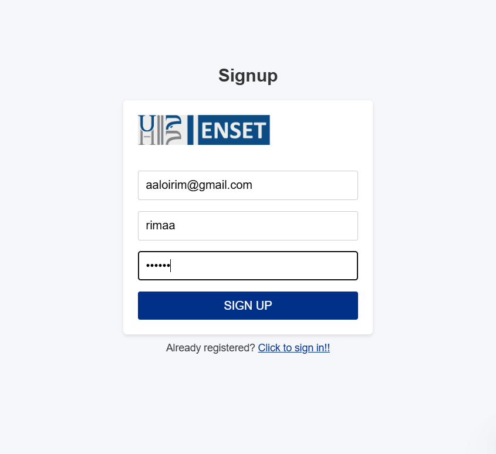
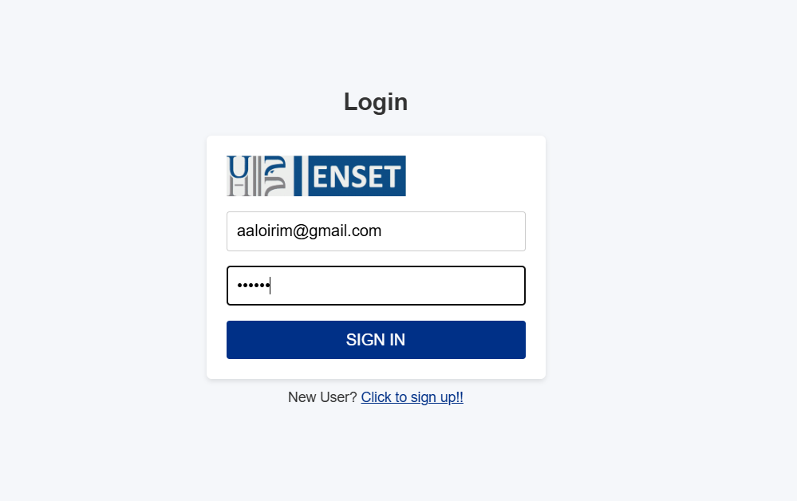
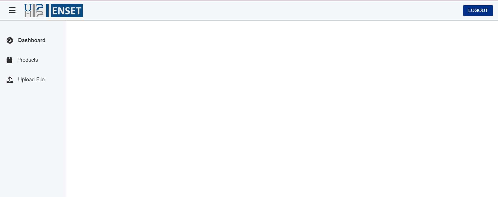

# 🔐 Authentication System - React Version

This project implements a complete user authentication system (Signup, Login, Logout) using React with JSON Server as a mock backend.

## 🚀 Features
- Protected dashboard
- Context API for session management
- Protected routes with React Router
- Responsive design
- Form validation

## 🛠️ Technologies
- React 18+
- React Router v6
- React Hook Form
- Axios for HTTP requests
- Context API + useReducer
- JSON Server (mock backend)
- Tailwind CSS for styling

## 🏁 Getting Started

### Prerequisites
- Node.js 16+
- npm/yarn
- JSON Server (install globally via `npm install -g json-server`)

## 📂 Project Structure
```
├── node_modules/
├── public/
├── src/
│ ├── components/
│ │ ├── Header.js
│ │ ├── MainContent.js
│ │ └── Sidebar.js
│ ├── pages/
│ │ ├── Dashboard.js
│ │ ├── Dashboard.css
│ │ ├── Login.js
│ │ ├── Login.css
│ │ ├── Products.js
│ │ ├── Signup.js
│ │ ├── Signup.css
│ │ └── UploadFile.js
│ ├── services/
│ │ └── authService.js
│ ├── App.css
│ ├── App.js
│ ├── App.test.js
│ ├── index.css
│ ├── index.js
│ ├── logo.svg
│ ├── reportWebVitals.js
│ └── setupTests.js
├── .gitignore
├── db.json
├── package-lock.json
└── package.json
```

## 📝 Available Scripts

- `npm start`: Start development server
- `npm run server`: Start JSON Server (`json-server --watch server/db.json --port 3001`)
- `npm run dev`: Concurrently run both server and app (requires `concurrently`)
- `npm run build`: Production build
- `npm test`: Run tests

## 📸 Screenshots
*Login Page*  
  
*Signup Page*  
  
*Dashboard*  
  

## 💌 Author

👩‍💻 **Rim Aaloi**  
💌 Contact: [GitHub Profile](https://github.com/RimAaloi) | [LinkedIn](https://www.linkedin.com/in/rim-aaloi/)  
